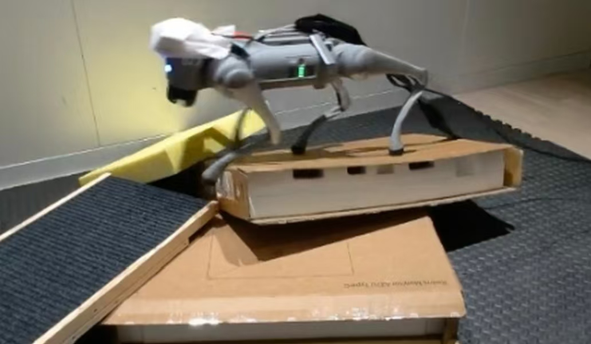
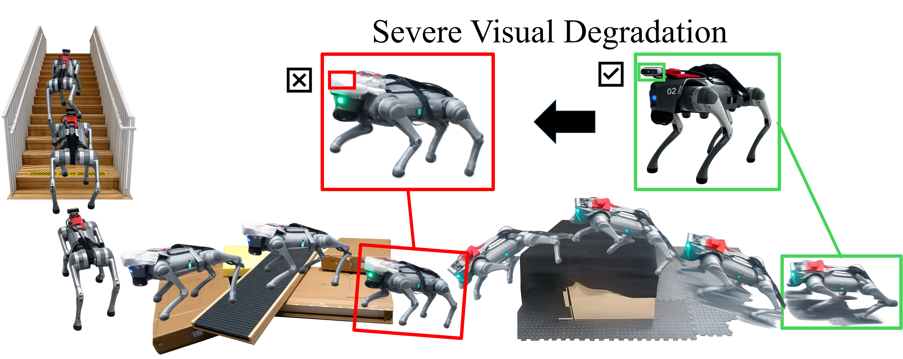
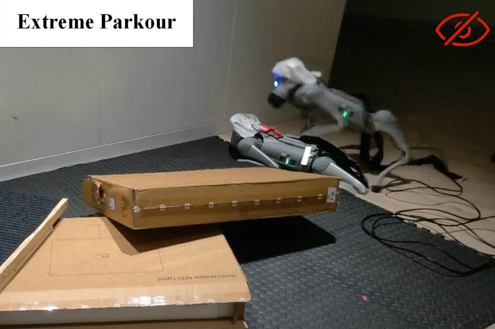
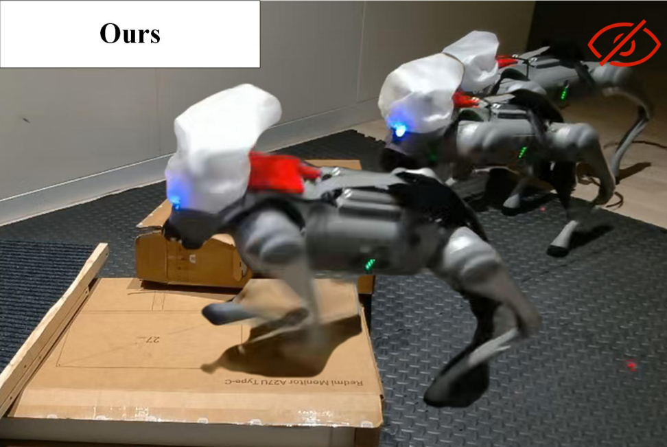
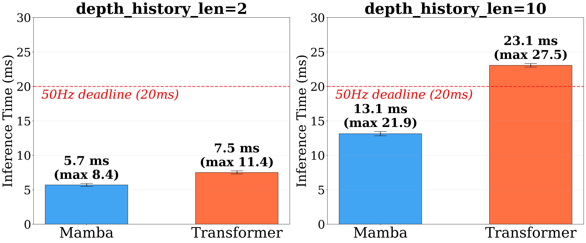
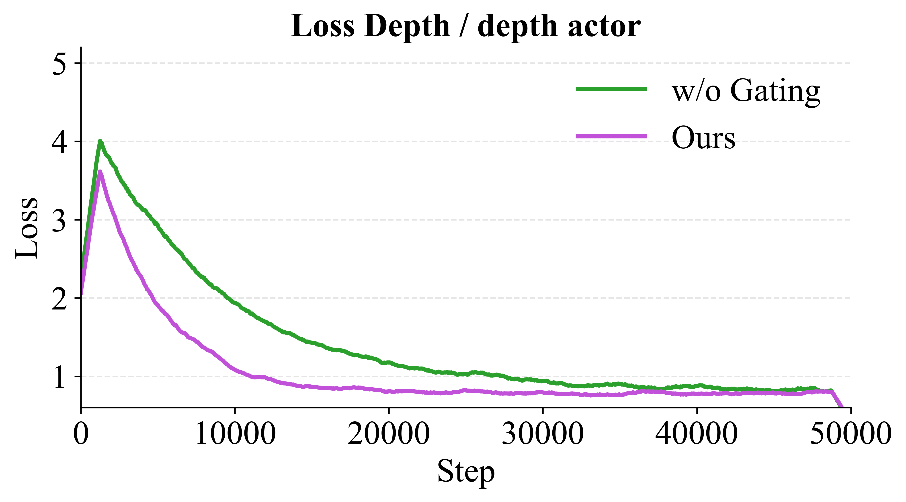

<div align="center">
# 🤖 REAL: Robust Extreme Agility Learning

### Robust Extreme Agility via Spatio-Temporal Policy Learning and Physics-Guided Filtering

[]()
[](LICENSE)
[](https://www.unitree.com/go2)
<br/>


<br/>



<p><i>
REAL enables a quadrupedal robot to chain highly dynamic parkour maneuvers across complex terrains<br/>
with nominal vision <b>(green box)</b>, and maintain stable locomotion even under severe visual degradation <b>(red box)</b>.
</i></p>

</div>

## 📋 Table of Contents

- [📰 News](#-news)
- [✨ Highlights](#-highlights)
- [🏗️ Architecture](#️-architecture)
- [📊 Results](#-results)
- [🌍 Real-World Deployment](#-real-world-deployment)
- [🔬 Ablation Study](#-ablation-study)
- [⚙️ Training Details](#️-training-details)
- [📝 TODO](#-todo)
- [🔖 Citation](#-citation)
- [🙏 Acknowledgements](#-acknowledgements)

---

## 📰 News

| Date | Update |
|:---|:---|
| 🔥 2026/03 | Paper submitted. Under review. |
| 🎉 2026/03 | Repository created. Code will be released upon acceptance. |

---

## ✨ Highlights

<table>
<tr>
<td width="50%">

🧠 **Spatio-Temporal Policy Learning**

A privileged teacher learns structured proprioception–terrain associations via cross-modal attention. The distilled student uses a **FiLM-modulated Mamba backbone** to suppress visual noise and build short-term terrain memory.

</td>
<td width="50%">

⚛️ **Physics-Guided Filtering**

An uncertainty-aware neural velocity estimator is fused with rigid-body dynamics through an **Extended Kalman Filter (EKF)**, ensuring physically consistent state estimation during impacts and slippage.

</td>
</tr>
<tr>
<td width="50%">

🎯 **Consistency-Aware Loss Gating**

Adaptive gating between behavioral cloning and RL **stabilizes policy distillation** and improves sim-to-real transfer, preventing policy collapse under aggressive domain randomization.

</td>
<td width="50%">

⚡ **Real-Time Onboard Deployment**

Bounded **O(1) inference** at ~13.1 ms/step on a Unitree Go2 with **zero-shot sim-to-real transfer** — no fine-tuning required on the real robot.

</td>
</tr>
</table>

---

## 🏗️ Architecture

<div align="center">

</div>

<br/>

> 🎓 **Stage 1 — Privileged Teacher Policy Learning:**
> The teacher policy learns precise proprioception–terrain associations through cross-modal attention. Proprioceptive states serve as Queries to selectively retrieve relevant terrain features encoded as Keys and Values from terrain scan dots.

> 🎒 **Stage 2 — Distilling Student Policy with Spatio-Temporal Reasoning:**
> The deployable student integrates FiLM-based visual–proprioceptive fusion with a Mamba temporal backbone. A physics-guided Bayesian estimator and consistency-aware loss gating further stabilize training and deployment.

---

## 📊 Results

### 🏔️ Extreme Terrain Traversability

<div align="center">

<br/><br/>
</div>

REAL achieves **2x the overall success rate** of the best prior baseline across hurdles, steps, and gaps:

| Method | Hurdles SR ↑ | Steps SR ↑ | Gaps SR ↑ | Overall SR ↑ | Overall MXD ↑ | MEV ↓ |
|:---|:---:|:---:|:---:|:---:|:---:|:---:|
| Extreme Parkour | 0.18 | 0.14 | 0.10 | 0.16 | 0.21 | 34.24 |
| RPL | 0.05 | 0.04 | 0.03 | 0.04 | 0.10 | 1.56 |
| SoloParkour | 0.42 | 0.49 | 0.36 | 0.39 | 0.34 | 96.93 |
| **REAL (Ours)** 🏆 | **0.82** | **0.94** | **0.28** | **0.78** | **0.45** | **18.41** |

> 📌 **SR**: Success Rate — how often the robot reaches all target goals. **MXD**: Mean X-Displacement ∈ [0, 1], showing normalized forward progress. **MEV**: Mean Edge Violations — average number of unsafe foot-edge contacts per episode.

<br/>

### 🛡️ Robustness Under Perceptual Degradation

We evaluate policy robustness under three simulated sensor degradation conditions: frame drops, Gaussian noise, and spatial FoV occlusion.

| Method | Nominal SR | Frame Drop SR | Gaussian Noise SR | FoV Occlusion SR |
|:---|:---:|:---:|:---:|:---:|
| Extreme Parkour | 0.16 | 0.16 (↓0.00) | 0.11 (↓0.05) | 0.13 (↓0.03) |
| RPL | 0.04 | 0.01 (↓0.04) | 0.01 (↓0.03) | 0.01 (↓0.03) |
| SoloParkour | 0.39 | 0.20 (↓0.19) | 0.37 (↓0.03) | 0.41 (↑0.02) |
| **REAL (Ours)** 🏆 | **0.78** | **0.61** (↓0.17) | **0.51** (↓0.27) | **0.72** (↓0.06) |

> 💡 Under severe FoV occlusion, REAL retains **92%** of its nominal performance (0.72 vs 0.78), while vision-reliant baselines suffer catastrophic failures.

<br/>

### 🙈 Blind-Zone Maneuvers

Vision is completely masked **1 meter before** each obstacle, forcing the policy to rely on spatio-temporal memory:

<div align="center">

<br/><br/>
</div>

| Method | SR ↑ | MXD ↑ | MEV ↓ |
|:---|:---:|:---:|:---:|
| Extreme Parkour | 0.11 | 0.20 | 44.03 |
| SoloParkour | 0.36 | 0.34 | 103.50 |
| **REAL (Ours)** 🏆 | **0.55** | **0.39** | **24.84** |

<br/>

### 👀 Real-World Extreme Blind Test

<div align="center">

| ❌ Baseline | ✅ REAL (Ours) |
|:---:|:---:|
|  |  |
| Fails immediately upon losing visual input | Maintains robust blind traversal across obstacles |

</div>

---

## 🌍 Real-World Deployment

<div align="center">

</div>

<br/>

Zero-shot sim-to-real transfer on a physical **Unitree Go2** quadruped using only onboard perception and computing:

| | Scenario | Description |
|:---:|:---|:---|
| 🦘 **(a)** | High Platform Leap | The robot dynamically jumps onto an elevated surface |
| 📦 **(b)** | Scattered Box Navigation | Traversing irregularly placed obstacles |
| 🪜 **(c)** | Steep Staircase Climb | Ascending a steep staircase with precise foot placement |

### ⏱️ Inference Latency

<div align="center">

</div>

<br/>

| Backbone | Avg. Latency | Meets 20 ms Budget? |
|:---|:---:|:---:|
| Transformer | 23.07 ms | ❌ No |
| **Mamba (Ours)** | **13.14 ms** | ✅ **Yes** |

> ⚡ Mamba's bounded O(1) complexity eliminates the sequence-scaling bottleneck of Transformers, enabling the high-frequency reactivity required for aggressive parkour.

---

## 🔬 Ablation Study

### 🧩 Component-Level Ablation

| Variant | SR ↑ | MXD ↑ | MEV ↓ | Time ↓ | Coll. ↓ |
|:---|:---:|:---:|:---:|:---:|:---:|
| **REAL (Full)** 🏆 | **0.78** | **0.45** | **18.41** | **0.02** | **0.06** |
| w/ MLP Estimator | 0.73 | 0.43 | 19.34 | 0.02 | 0.06 |
| w/o FiLM | 0.44 | 0.51 | 93.43 | 0.28 | 0.06 |
| w/o Mamba | 0.51 | 0.47 | 89.96 | 0.26 | 0.05 |

> 📌 Removing Mamba causes MEV to increase nearly **5x** (18→90). Disabling FiLM drops SR by **44%**. Both are critical for robust spatio-temporal reasoning.

### 📏 Velocity Estimation

| Estimator | RMSE ↓ |
|:---|:---:|
| MLP (Baseline) | 0.52 |
| MLP + EKF | 0.40 |
| 1D ResNet (Single frame) | 0.33 |
| 1D ResNet (10 frames) | 0.28 |
| **1D ResNet + EKF (10 frames, Ours)** 🏆 | **0.23** |

### 📈 Training Convergence

<div align="center">

</div>

> 💡 Our consistency-aware loss gating accelerates early-stage convergence and achieves a lower final training loss compared to a fixed-weight baseline.

---

## ⚙️ Training Details

| Item | Detail |
|:---|:---|
| 🖥️ Simulator | [Isaac Gym](https://developer.nvidia.com/isaac-gym) |
| 🐕 Robot Platform | [Unitree Go2](https://www.unitree.com/go2) |
| 🔄 Control Frequency | 50 Hz (policy) / 1 kHz (PD controller) |
| 🎮 Training Hardware | Single NVIDIA RTX 4080 GPU |
| ⏳ Training Time | ~30 hours (from scratch) |
| 📷 Depth Camera | Intel RealSense D435i |
| 💻 Onboard Compute | NVIDIA Jetson |
| 🚀 Deployment | Custom C++ + ONNX Runtime |
| 🎯 Reward Formulation | Same as [Extreme Parkour](https://extreme-parkour.github.io/) |

---

## 📝 TODO

We plan to release the full codebase upon paper acceptance. The following items are on our roadmap:

**🏋️ Training**
- [ ] Privileged teacher policy training code (Stage 1)
- [ ] Student distillation training code (Stage 2)
- [ ] Consistency-aware loss gating implementation
- [ ] Isaac Gym terrain environment and curriculum configs
- [ ] Domain randomization parameters and reward formulation

**🧮 Models & Estimation**
- [ ] Physics-guided filtering (EKF) module
- [ ] Uncertainty-aware velocity estimator (1D ResNet)
- [ ] Pre-trained model checkpoints (teacher & student)

---

## 🔖 Citation

If you find this work useful, please consider citing:

```bibtex
@article{real2026,
  title   = {REAL: Robust Extreme Agility via Spatio-Temporal
             Policy Learning and Physics-Guided Filtering},
  author  = {Jialong Liu, Dehan Shen, Yanbo Wen,
             Zeyu Jiang and Changhao Chen},
  year    = {2026}
}
```

## 🙏 Acknowledgements

This work builds upon the simulation infrastructure of [Isaac Gym](https://developer.nvidia.com/isaac-gym) and the terrain setup from [Extreme Parkour](https://extreme-parkour.github.io/). We thank the authors for their open-source contributions.

## 📄 License

This project will be released under the [MIT License](LICENSE).
